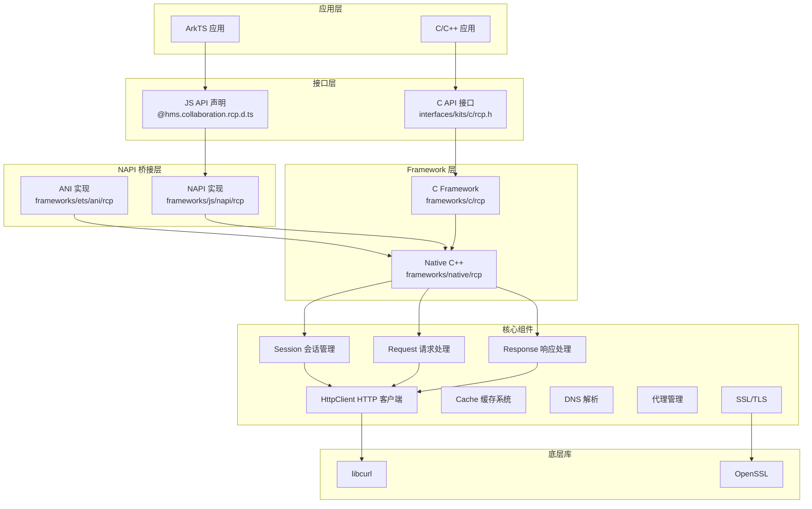

# RCP 架构总览

## 模块职责

RCP (Remote Communication Protocol) 模块是远程通信组件，提供基于 HTTP/HTTPS 协议的网络请求能力。主要职责包括：

- 提供 HTTP/HTTPS 网络请求功能
- 支持同步和异步请求模式
- 会话管理和连接复用
- 缓存机制
- 代理配置
- SSL/TLS 安全传输
- 网络状态监听
- Cookie 管理
- 文件上传下载

## 组件层次



## 模块划分

### 1. 接口层 (interfaces/)

#### C API 接口 (kits/c/)
- **文件**: `interfaces/kits/c/rcp.h`
- **功能**: 提供 C 语言的 API 接口
- **主要接口**:
  - `HMS_Rcp_CreateSession` - 创建会话
  - `HMS_Rcp_DestroySession` - 销毁会话
  - `HMS_Rcp_CreateRequest` - 创建请求
  - `HMS_Rcp_ExecuteSync` - 同步执行请求
  - `HMS_Rcp_ExecuteAsync` - 异步执行请求

#### 内部接口 (innerkits/)
- **Session**: `interfaces/innerkits/include/rcp/session.h` - 会话接口定义
- **Request**: `interfaces/innerkits/include/rcp/request.h` - 请求接口定义
- **Response**: `interfaces/innerkits/include/rcp/response.h` - 响应接口定义
- **Configuration**: `interfaces/innerkits/include/rcp/configuration.h` - 配置接口
- **Error**: `interfaces/innerkits/include/rcp/error.h` - 错误定义

### 2. Framework 层

#### C Framework (frameworks/c/rcp/)
- **HTTP Session**: `frameworks/c/rcp/http_session/` - HTTP 会话实现
- **Common**: `frameworks/c/rcp/common/` - 通用工具

#### Native C++ (frameworks/native/rcp/)
- **核心组件**:
  - `session.cpp` - 会话实现
  - `request.cpp` - 请求实现
  - `response.cpp` - 响应实现
  - `http_session.cpp` - HTTP 会话
  - `configuration.cpp` - 配置管理

- **Curl 集成** (frameworks/native/rcp/src/curl/):
  - `curl_request_parser.cpp` - Curl 请求解析
  - `curl_response_parser.cpp` - Curl 响应解析
  - `curl_configuration.cpp` - Curl 配置
  - `epoll_multi_driver.cpp` - Epoll 多路复用驱动
  - `epoll_request_handler.cpp` - Epoll 请求处理

- **缓存系统** (frameworks/native/rcp/src/cache/):
  - `response/response_cache.cpp` - 响应缓存
  - `persistent/cache.cpp` - 持久化缓存
  - `persistent/folder_storage.cpp` - 文件夹存储

#### NAPI 桥接层 (frameworks/js/napi/rcp/)
- **NAPI 实现**:
  - `collaboration_rcp.cpp` - 主要 NAPI 接口
  - `napi_manager.cpp` - NAPI 管理器
  - `napi_parser.cpp` - NAPI 参数解析
  - `napi_data_recorder.cpp` - 数据记录
  - `napi_data_requester.cpp` - 数据请求

#### ANI 层 (frameworks/ets/ani/rcp/)
- **ANI 实现**:
  - `@hms.collaboration.rcp.ani.cpp` - ANI 接口
  - `session_factory.cpp` - 会话工厂
  - `request_factory.cpp` - 请求工厂
  - `response_ani_parser.cpp` - 响应解析

### 3. 工具层 (utils/)
- **日志**: `utils/include/rcp_native_log.h`
- **错误处理**: `utils/include/rcp_error_utils.h`
- **网络工具**: `utils/include/rcp_native_common_utils.h`
- **NAPI 工具**: `utils/include/napi_utils.h`
- **TLV 解析**: `utils/include/tlv_utils.h`

## 依赖关系

### 内部依赖

```
NAPI 层
  ↓
Native C++ 层
  ↓
C Framework 层
  ↓
Curl/OpenSSL
```

### 外部依赖

1. **系统依赖**:
   - `libcurl` - HTTP 客户端库
   - `OpenSSL` - SSL/TLS 支持
   - `cutils` - C 工具库
   - `hilog` - 日志系统
   - `netstack` - 网络栈

2. **系统能力**:
   - `SystemCapability.Collaboration.RemoteCommunication` - 远程通信能力
   - `@ohos.url` - URL 解析
   - `@ohos.security.cert` - 证书处理
   - `@ohos.file.fs` - 文件系统

## 数据流转

### 请求流程
```
应用层
  → NAPI 桥接层 (参数解析、Promise 创建)
  → Native C++ 层 (Session::FetchWithInfo)
  → Curl 层 (HTTP 请求执行)
  → 网络传输
```

### 响应流程
```
网络传输
  → Curl 层 (响应解析)
  → Native C++ 层 (Response 对象构建)
  → NAPI 桥接层 (JS 对象转换)
  → 应用层
```

## 线程模型

- **主线程**: NAPI 调用入口
- **工作线程**: 实际网络请求执行
- **回调线程**: 使用 `napi_threadsafe_function` 安全回调

## 源文件路径引用

- JS API 声明: `hmscore_sdk_js/api/@hms.collaboration.rcp.d.ts`
- C API 接口: `interfaces/kits/c/rcp.h`
- Session 接口: `interfaces/innerkits/include/rcp/session.h`
- NAPI 实现: `frameworks/js/napi/rcp/src/collaboration_rcp.cpp`
- Session 实现: `frameworks/native/rcp/src/session.cpp`
- Curl 集成: `frameworks/native/rcp/src/curl/`
