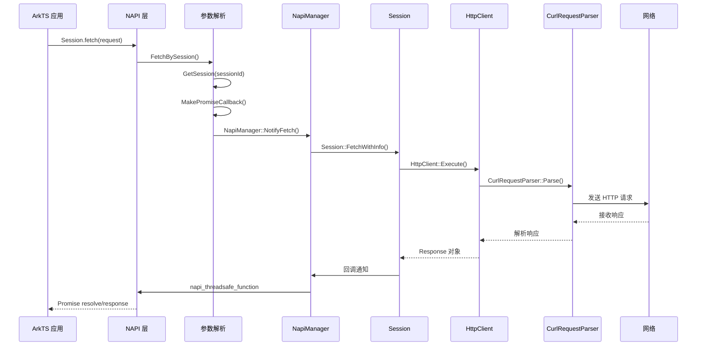
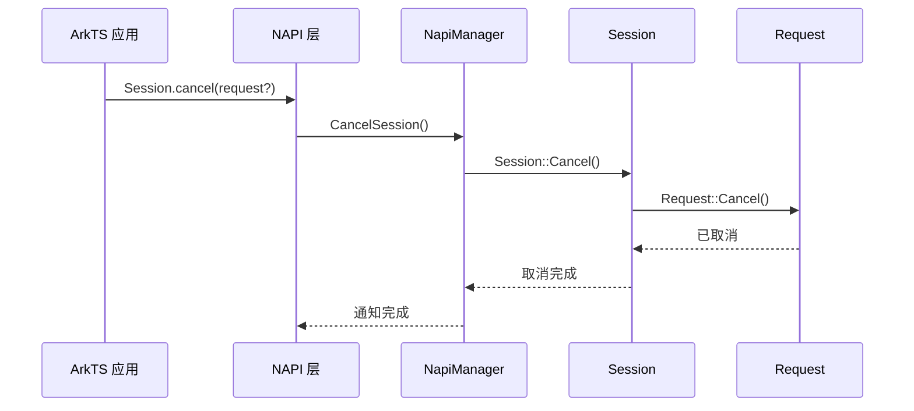
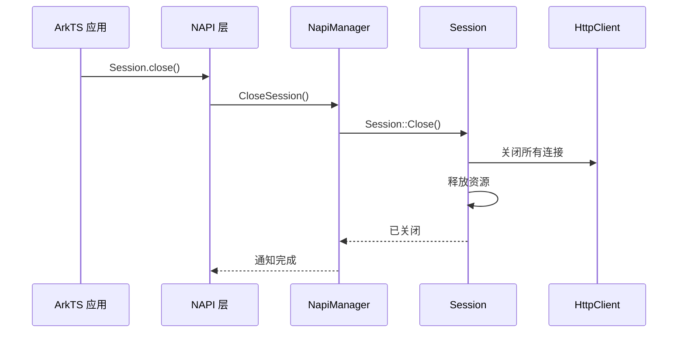
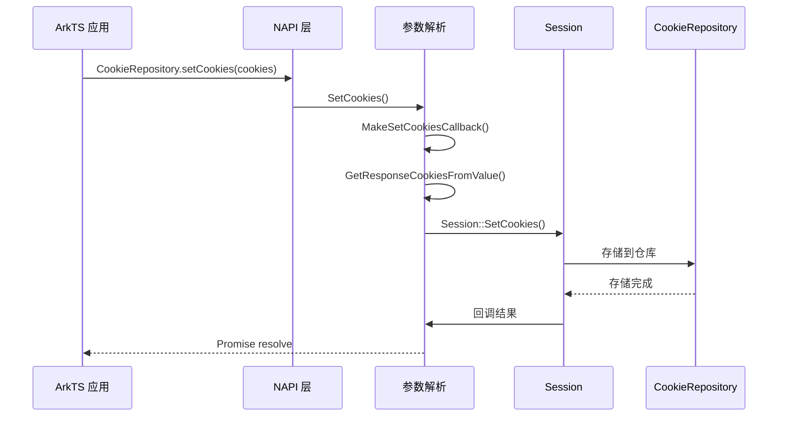
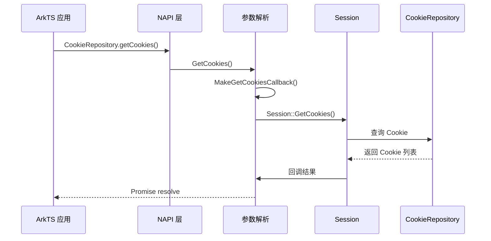
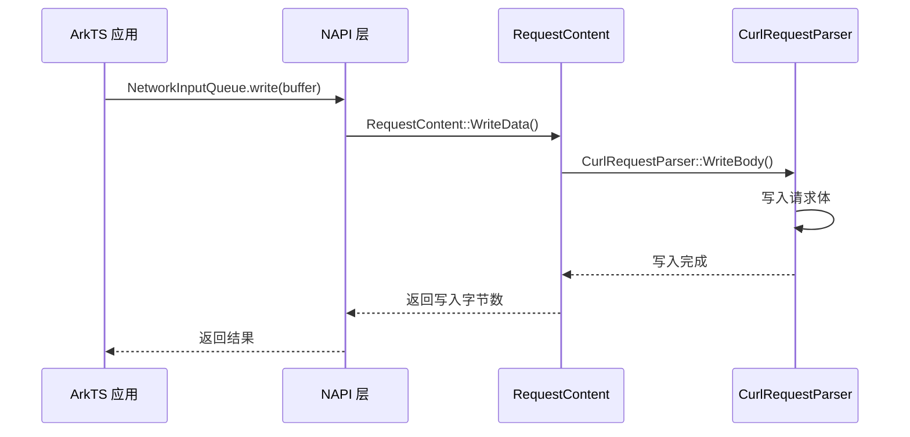
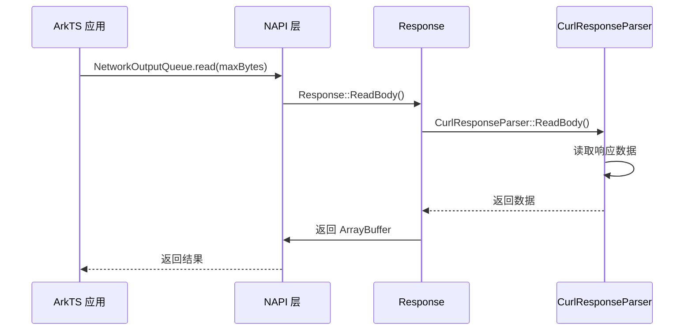
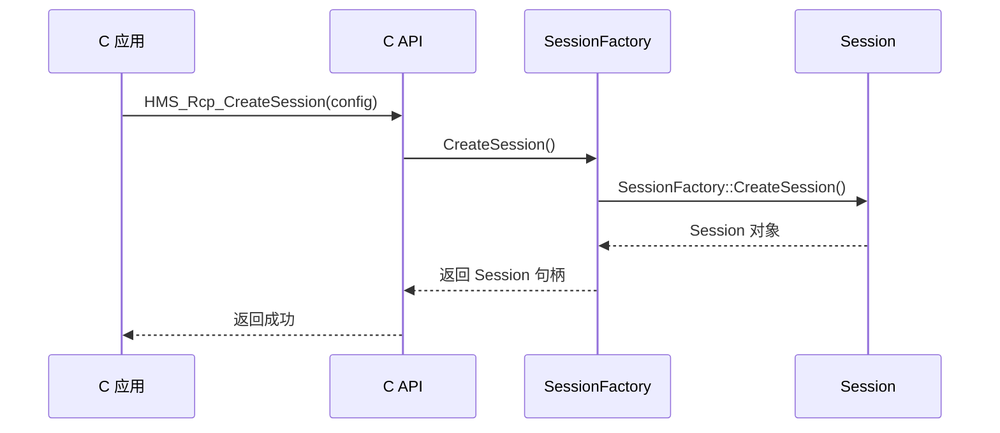
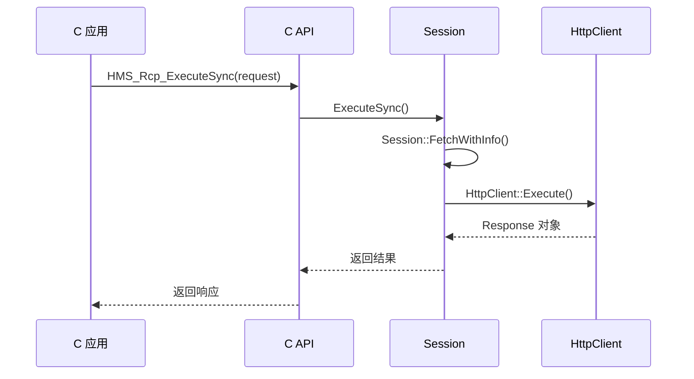

# RCP API 调用链流程

## Session.fetch 请求执行

### 完整调用链

### 源码路径

- **NAPI 入口**: `frameworks/js/napi/rcp/src/collaboration_rcp.cpp:309` - `FetchBySession`
- **参数解析**: `frameworks/js/napi/rcp/src/napi_parser.cpp`
- **管理器**: `frameworks/js/napi/rcp/src/napi_manager.cpp`
- **Session 实现**: `frameworks/native/rcp/src/session.cpp` - `Session::FetchWithInfo`
- **HTTP 客户端**: `frameworks/native/rcp/src/http_session.cpp` - `HttpClient::Execute`
- **Curl 解析**: `frameworks/native/rcp/src/curl/curl_request_parser.cpp` - `CurlRequestParser::Parse`

### 参数传递

1. **输入参数**:
   - `Request` 对象 (包含 URL、method、headers、body 等)
   - `Session` 标识符

2. **中间传递**:
   - NAPI 层解析为 C++ `Request` 对象
   - 通过 `FetchContext` 封装请求上下文
   - 传递给 `Session::FetchWithInfo`

3. **返回值处理**:
   - Curl 返回原始 HTTP 响应
   - `CurlResponseParser` 解析为 `Response` 对象
   - NAPI 层转换为 JS `Response` 对象
   - 通过 Promise 返回给应用

## Session.cancel 取消请求

### 调用链

### 源码路径

- **NAPI 入口**: `frameworks/js/napi/rcp/src/collaboration_rcp.cpp:544` - `CancelSession`
- **管理器**: `frameworks/js/napi/rcp/src/napi_manager.cpp` - `NapiManager::NotifyCancel`
- **实现**: `frameworks/native/rcp/src/session.cpp` - `Session::Cancel`
- **请求取消**: `frameworks/native/rcp/src/request.cpp` - `Request::Cancel`

## Session.close 关闭会话

### 调用链

### 源码路径

- **NAPI 入口**: `frameworks/js/napi/rcp/src/collaboration_rcp.cpp:573` - `CloseSession`
- **管理器**: `frameworks/js/napi/rcp/src/napi_manager.cpp` - `NapiManager::NotifyClose`
- **实现**: `frameworks/native/rcp/src/session.cpp` - `Session::Close`

## Cookie 管理

### CookieRepository.setCookies

### 源码路径

- **NAPI 入口**: `frameworks/js/napi/rcp/src/collaboration_rcp.cpp:493` - `SetCookies`
- **参数解析**: `frameworks/js/napi/rcp/src/napi_parser.cpp` - `GetResponseCookiesFromValue`
- **实现**: `frameworks/native/rcp/src/session.cpp` - `Session::SetCookies`
- **Cookie 仓库**: `frameworks/native/rcp/src/curl/cookie_repo_map.cpp`

### CookieRepository.getCookies

### 源码路径

- **NAPI 入口**: `frameworks/js/napi/rcp/src/collaboration_rcp.cpp:506` - `GetCookies`
- **实现**: `frameworks/native/rcp/src/session.cpp` - `Session::GetCookies`

## 数据流处理

### NetworkInputQueue.write 写入数据

### 源码路径

- **NAPI 实现**: `frameworks/js/napi/rcp/src/napi_data_recorder.cpp` - `NetworkInputQueue::write`
- **请求内容**: `frameworks/native/rcp/src/request_content.cpp` - `RequestContent::WriteData`
- **Curl 写入**: `frameworks/native/rcp/src/curl/curl_request_parser.cpp` - `CurlRequestParser::WriteBody`

### NetworkOutputQueue.read 读取数据

### 源码路径

- **NAPI 实现**: `frameworks/js/napi/rcp/src/napi_data_requester.cpp` - `NetworkOutputQueue::read`
- **响应处理**: `frameworks/native/rcp/src/response.cpp` - `Response::ReadBody`
- **Curl 读取**: `frameworks/native/rcp/src/curl/curl_response_parser.cpp` - `CurlResponseParser::ReadBody`

## C API 调用链

### HMS_Rcp_CreateSession

### 源码路径

- **C API**: `interfaces/kits/c/rcp.h`
- **实现**: `frameworks/c/rcp/rcp_session.c` - `CreateSession`
- **工厂**: `frameworks/native/rcp/src/session.cpp` - `SessionFactory::CreateSession`

### HMS_Rcp_ExecuteSync

### 源码路径

- **C API**: `interfaces/kits/c/rcp.h`
- **实现**: `frameworks/c/rcp/rcp_request.c` - `ExecuteSync`
- **Session**: `frameworks/native/rcp/src/session.cpp` - `Session::FetchWithInfo`

## NAPI 映射模式

### Promise 回调模式

用于异步操作，如 `FetchBySession`, `SetCookies`, `GetCookies`:

1. 使用 `napi_create_promise` 创建 Promise
2. 通过 `napi_threadsafe_function` 在不同线程安全调用
3. 使用 `napi_resolve_deferred` 或 `napi_reject_deferred` 完成 Promise

**示例**: `frameworks/js/napi/rcp/src/collaboration_rcp.cpp:309` - `FetchBySession`

### 同步返回模式

用于同步操作，如 `GenerateRequestId`, `GenerateSessionId`:

1. 直接执行操作
2. 使用 `NapiUtils` 创建返回值
3. 立即返回结果

**示例**: `frameworks/js/napi/rcp/src/collaboration_rcp.cpp:123` - `GenerateRequestId`

### 参数验证模式

所有 NAPI 函数都使用此模式:

1. 使用 `napi_get_cb_info` 获取参数
2. 通过 `NapiUtils` 验证类型和值
3. 验证失败时抛出错误

**示例**: `frameworks/js/napi/rcp/include/napi_parser.h`

### 错误处理模式

1. 使用 `ThrowNapiError` 抛出错误
2. 或通过 `CreateNapiRcpError` 创建错误对象
3. 在 Promise 中使用 `napi_reject_deferred`

**示例**: `frameworks/js/napi/rcp/src/collaboration_rcp.cpp:655` - `GetError`

### 线程安全模式

使用 `napi_threadsafe_function` 在不同线程间安全调用回调:

1. 创建 `napi_threadsafe_function`
2. 在工作线程中调用
3. 在主线程中执行回调

**示例**: `frameworks/js/napi/rcp/src/napi_manager.cpp` - `NapiManager`

## 关键源文件

- **NAPI 主入口**: `frameworks/js/napi/rcp/src/collaboration_rcp.cpp`
- **NAPI 管理器**: `frameworks/js/napi/rcp/src/napi_manager.cpp`
- **参数解析**: `frameworks/js/napi/rcp/src/napi_parser.cpp`
- **Session 实现**: `frameworks/native/rcp/src/session.cpp`
- **HTTP 会话**: `frameworks/native/rcp/src/http_session.cpp`
- **Curl 请求**: `frameworks/native/rcp/src/curl/curl_request_parser.cpp`
- **Curl 响应**: `frameworks/native/rcp/src/curl/curl_response_parser.cpp`
- **C API 实现**: `frameworks/c/rcp/` 目录
