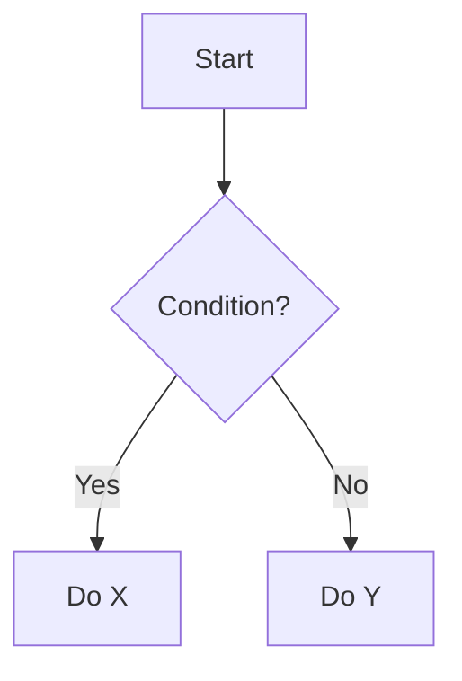

# Skill 内容职责审查指南

本文档详细说明如何区分 Skill 型内容和知识库型内容，并提供具体的判断标准和修复方案。

---

## 一、核心判断框架

### 1.1 根本区别

| 维度 | Skill(技能) | 知识库 (Knowledge Base) |
|------|------------|------------------------|
| **目的** | 教 AI"如何做"某事 | 教 AI"是什么"知识 |
| **内容** | 工作流程、步骤、指令 | 概念、理论、历史 |
| **动词** | 执行、检查、验证 | 是、有、包括、包含 |
| **句子** | 祈使句 ("做 X") | 陈述句 ("X 是...") |
| **输出** | 可执行的行动 | 知识性理解 |

---

### 1.2 快速判断方法

**问自己三个问题:**

```markdown
问题 1: 这段内容是教 AI 做事，还是教 AI 知识？
- 教做事 → Skill ✅
- 教知识 → 知识库 ❌

问题 2: AI 看完能立即执行某个任务吗？
- 能 → Skill ✅
- 不能，只是了解了知识 → 知识库 ❌

问题 3: 如果删除这段，AI 还能完成任务吗？
- 能，只是缺少背景知识 → 应该移至 references/
- 不能，缺少关键步骤 → 应该保留在 SKILL.md
```

---

## 二、知识库型内容的识别与处理

### 2.1 典型特征

**出现以下词汇时警惕:**
```
什么是...
是指...
定义为...
...的历史
...的发展
...的原理
基于...理论
根据...学说
```

**典型句式:**
```markdown
## 什么是 ArkTS
ArkTS 是一种... (500 字理论介绍)

## TypeScript 的发展历史
TypeScript 诞生于 2012 年... (300 字背景)

## 静态类型的概念
静态类型是指在编译时确定类型的系统... (400 字解释)
```

---

### 2.2 为什么不应该在 SKILL.md

**原因:**
1. **浪费上下文空间** - 这些知识 AI 训练时已经学过
2. **降低执行效率** - AI 需要跳过大量文字找到指令
3. **违反渐进式披露** - 应该在需要时才加载详细知识

**正确做法:**
```markdown
SKILL.md:
## 类型检查步骤
1. 扫描所有变量声明
2. 验证是否有类型注解
3. 标记缺少类型的问题

references/type-system.md:
## 什么是类型系统
类型系统是编程语言的核心组成部分...
(详细的理论知识供 AI 需要时查阅)
```

---

### 2.3 修复方案

**方案 A: 直接删除**
```markdown
# 原文 (包含知识库内容)
## 什么是代码审查
代码审查是一种软件质量保证活动...
通过审查代码可以发现 bug、提高质量...

## 代码审查步骤
1. 快速扫描代码
2. 识别明显问题
3. 深度分析
```

修改为:
```markdown
## 代码审查步骤
1. 快速扫描代码
   - 检查语法错误
   - 查找缺失的类型注解
   - 识别 console.log 语句

2. 深度分析
   - 检查每个函数的正确性
   - 评估性能
   - 审查安全性
```

**方案 B: 移至 references/**
```markdown
# 在 SKILL.md 中
## 参考文档
- 需要了解代码审查理论？查看 [references/code-review-theory.md](references/code-review-theory.md)
- 学习审查技巧？查看 [references/review-techniques.md](references/review-techniques.md)

# 在 references/code-review-theory.md 中
## 什么是代码审查
代码审查是一种... (完整理论介绍)
```

---

## 三、Skill 型内容的标准

### 3.1 必备元素

**完整的 Skill 必须包含:**

```markdown
## 工作流程 (Workflow)
### 输入
- 用户提供什么？

### 处理步骤
1. 第一步做什么
2. 第二步做什么
3. ...

### 输出
- 最终交付什么？

## 检查清单 (Checklist)
- [ ] 检查项 1
- [ ] 检查项 2
- [ ] ...

## 决策树 (Decision Tree)
遇到情况 A 怎么办？
├─ 条件 1 满足 → 执行 X
└─ 条件 2 满足 → 执行 Y
```

---

### 3.2 优秀示例

**示例 1: 代码审查 Skill**
```markdown
## Code Review Workflow

### Step 1: Quick Scan (5 minutes)
Check for obvious issues:
- [ ] Syntax errors
- [ ] Missing type annotations  
- [ ] Console.log statements

### Step 2: Deep Analysis (15-30 minutes)
Review each function for:
1. Correctness - does it work?
2. Performance - is it efficient?
3. Security - any vulnerabilities?
4. Maintainability - easy to understand?

### Step 3: Provide Feedback
For each issue found:
- Note location (file:line number)
- Classify severity (Critical/Warning/Info)
- Explain the problem clearly
- Show fixed code example

### Output Format
Generate report in this structure:
# Code Review Report

## Summary
- Critical: X issues
- Warning: Y issues  
- Info: Z issues

## Detailed Findings
[Detailed list with fixes]
```

**特点分析:**
- ✅ 清晰的时间框 (5 分钟、15-30 分钟)
- ✅ 具体的检查项 (带复选框)
- ✅ 明确的步骤编号
- ✅ 详细的输出格式
- ✅ 完全可执行

---

### 3.3 对比：差劲的 Skill

**反面教材:**
```markdown
## About Code Review

Code review is an important software quality assurance activity. 
Many studies have shown that code review can help find bugs early, 
improve code quality, and facilitate knowledge sharing among team members...

The history of code review dates back to the 1970s when...

There are many types of code reviews:
- Formal inspections
- Walkthroughs
- Pair programming
- Tool-assisted reviews

Each type has its own characteristics and use cases...
```

**问题分析:**
- ❌ 全是理论知识，没有操作指令
- ❌ 历史背景介绍 (不必要)
- ❌ 分类说明 (不告诉 AI 怎么做)
- ❌ 没有任何工作流程
- ❌ 没有检查清单或决策树

**结论:** 这是知识库，不是 Skill!

---

## 四、工作流程设计详解

### 4.1 基本结构

**最小可行工作流程:**
```markdown
## Workflow

### Input
User provides: [what user gives]

### Process  
1. Do X
2. Check Y
3. If A then Z else W

### Output
Return: [what you deliver]
```

---

### 4.2 详细程度把控

**过简 (不好):**
```markdown
## Steps
1. Check the code
2. Find problems
3. Give suggestions
```
**问题:** 太笼统，无法执行

**适中 (推荐):**
```markdown
## Workflow

### Step 1: Scan for Type Errors
Go through all variable declarations:
- Check if explicit type annotation exists
- Verify type matches inferred value
- Flag missing types as Warning

### Step 2: Check Decorator Usage
For each @ decorator:
- If @State → must be private
- If @Prop → parent-to-child data flow
- If @Link → two-way binding
```

**过详 (也不好):**
```markdown
## Step 1: Variable Declaration Scanning Process

First, you need to understand what a variable declaration is.
In programming, a variable is a storage location...

There are several types of variable declarations:
1. Using 'var' keyword (not recommended in ArkTS)
2. Using 'let' keyword (preferred)
3. Using 'const' keyword (for constants)

For each type, you should check different things:
... (500 more words of theory)
```
**问题:** 包含不必要的理论知识

---

### 4.3 时间框定

**给每个步骤设定预计时间:**
```markdown
### Phase 1: Automated Checks (2-3 minutes)
Run scripts/check-skill-format.sh

### Phase 2: Manual Review (10-15 minutes)
Carefully examine the content

### Phase 3: Report Generation (5 minutes)
Write up findings
```

**好处:**
- 帮助用户了解耗时
- 便于规划工作
- 体现专业性

---

## 五、检查清单设计规范

### 5.1 分级检查清单

**三级分类:**
```markdown
### Critical (必须修复)
Issues that block functionality or violate core standards:
- [ ] All variables have explicit type annotations
- [ ] No usage of any/unknown types
- [ ] @State variables are marked private

### Warning (建议修复)  
Issues that impact quality but don't block:
- [ ] Hot loops extract constants
- [ ] Avoided deep nesting
- [ ] Used appropriate container components

### Info (可选改进)
Suggestions for improvement:
- [ ] Consistent naming style
- [ ] Adequate comments
- [ ] Good code organization
```

---

### 5.2 检查项编写要点

**好的检查项:**
```markdown
✅ 具体可验证
- [ ] 所有变量都有类型注解
- [ ] 未使用 any/unknown 类型
- [ ] @State 变量为 private

❌ 模糊不可验证
- [ ] 代码质量好
- [ ] 性能优秀
- [ ] 遵循最佳实践
```

**要点:**
- 使用明确的动词 (检查、验证、确保)
- 描述可观察的行为或属性
- 避免主观判断词汇

---

### 5.3 检查项数量

**推荐:**
- 简单 Skill: 5-10 个检查项
- 中等 Skill: 10-20 个检查项
- 复杂 Skill: 20-30 个检查项 (分多个类别)

**避免:**
- 太少 (<5 个) - 不够全面
- 太多 (>50 个) - 难以完成

---

## 六、决策树设计模板

### 6.1 何时需要决策树

**需要决策树的场景:**
```
Skill 复杂度评估:
├─ 只有 1 种处理方式 → 不需要决策树
├─ 2-3 种处理方式 → 建议有决策树
└─ >3 种处理方式 → 必须有决策树
```

---

### 6.2 决策树基本结构

**基础模板:**
```markdown
## Decision Logic

### Question 1: [判断条件]?
├─ Yes (满足条件 A) → Action X
└─ No (满足条件 B) → Action Y

### Question 2: [判断条件]?
├─ Case 1 → Process A
├─ Case 2 → Process B
└─ Case 3 → Process C
```

---

### 6.3 实际案例

**案例 1: 问题分级决策树**
```markdown
## Issue Classification

Severity assessment:
```
Does it cause compilation failure?
├─ Yes → Critical (must fix)
│   └─ Action: Block merge until fixed
└─ No → Continue assessment
    │
    Does it impact performance significantly?
    ├─ Yes → Warning (should fix)
    │   └─ Action: Recommend fixing, track as tech debt
    └─ No → Continue assessment
        │
        Is it about code style or naming?
        ├─ Yes → Info (optional improvement)
        │   └─ Action: Suggest for consistency
        └─ No → Re-evaluate manually
```
```

**案例 2: Skill vs 知识库判断**
```markdown
## Content Type Decision

For each section in SKILL.md:
```
Is this teaching "how to do" something?
├─ Yes → Keep in SKILL.md ✅
└─ No → Continue assessment
    │
    Is this explaining "what is" something?
    ├─ Yes → Move to references/ ❌
    └─ No → Continue assessment
        │
        Is this background or history?
        ├─ Yes → Remove or move to references/background.md ❌
        └─ No → Manual review needed
```
```

---

### 6.4 决策树 vs 流程图

**决策树 (推荐):**
```markdown
简单易读，适合文本展示:
Condition?
├─ A → X
└─ B → Y
```

**流程图 (复杂时用):**


---

## 七、常见反模式与修复

### 反模式 1: 伪装成 Skill 的知识库

**表现:**
```markdown
# PDF Processing Skill

## What is PDF Processing
PDF processing involves manipulating Portable Document Format files...
(500 words of theory)

## History of PDF
PDF was developed by Adobe in the 1990s...
(300 words of history)

## Types of PDF Operations
There are many types of operations you can perform on PDFs...
(list without how-to instructions)
```

**修复:**
```markdown
# PDF Processing Skill

## Workflow

### Task 1: Text Extraction
Input: PDF file path
Process:
1. Validate file exists and is readable
2. Use pdfplumber.open() to open PDF
3. Iterate through pages and extract text
4. Return extracted text in Markdown format
Output: Formatted text string

### Task 2: Form Filling
Input: PDF form + data dictionary
Process:
1. Load PDF form using pdftk
2. Map data keys to form field names
3. Fill each field with corresponding value
4. Flatten form to prevent further editing
5. Save completed PDF
Output: Filled PDF file
```

---

### 反模式 2: 缺少决策逻辑

**表现:**
```markdown
## Steps
1. Review the code
2. Find issues
3. Report findings
```

**修复:**
```markdown
## Workflow with Decisions

### Step 1: Initial Assessment
Determine review depth needed:
- Small change (<50 lines) → Light review (15 min)
- Medium change (50-200 lines) → Standard review (1 hour)
- Large change (>200 lines) → Deep review (2+ hours, consider splitting)

### Step 2: Issue Detection
For each finding, classify:
- Compilation error → Critical
- Security vulnerability → Critical  
- Performance issue → Warning
- Style inconsistency → Info
```

---

### 反模式 3: 检查清单不可操作

**表现:**
```markdown
## Checklist
- [ ] Code is good
- [ ] Performance is optimal
- [ ] Follows best practices
- [ ] Well documented
```

**修复:**
```markdown
## Checklist

### Correctness
- [ ] No syntax errors
- [ ] All variables declared before use
- [ ] All functions return correct type

### Performance
- [ ] Hot loops avoid redundant property access
- [ ] Large lists use LazyVStack
- [ ] Expensive computations cached

### Documentation
- [ ] Public functions have doc comments
- [ ] Complex logic has explanatory comments
- [ ] API changes noted in CHANGELOG
```

---

## 八、内容放置决策树

**判断某段内容应该放在哪里:**

```
这段内容是什么类型？
├─ 操作流程/步骤 → SKILL.md ✅
├─ 检查清单/规则 → SKILL.md ✅
├─ 决策逻辑/判断 → SKILL.md ✅
├─ 快速参考表 → SKILL.md ✅ (保持简洁)
├─ 理论知识/概念 → references/concepts.md ❌
├─ API 参数详情 → references/api-reference.md ❌
├─ 大量代码示例 → references/examples.md ❌
├─ 历史背景 → references/background.md ❌
└─ 扩展阅读 → references/further-reading.md ❌
```

---

## 九、渐进式披露实现

### 9.1 三层披露机制

```
Layer 1: 元数据 (name/description)
↓ 系统启动时加载，用于发现匹配
↓
Layer 2: SKILL.md 全文
↓ 触发技能时加载，用于执行任务
↓
Layer 3: references/文件
↓ 按需加载，用于获取详细知识
```

---

### 9.2 SKILL.md 引用参考文献

**正确的引用方式:**
```markdown
## Additional Resources

For detailed type system rules, see:
- [Type System Specification](references/type-system.md)
- [Type Inference Rules](references/type-inference.md)

For migration patterns, consult:
- [Migration Guide Overview](references/migration-guide/index.md)
- [Common Patterns](references/migration-guide/patterns.md)
```

**注意事项:**
- ✅ 使用相对路径
- ✅ 保持一层深度 (避免 ../../deep/path)
- ✅ 提供简短说明 (为什么要看这个)
- ❌ 不要深层嵌套引用

---

## 十、审查检查清单

审查内容职责时使用:

```markdown
### 内容类型检查
- [ ] 主要是"如何做"的指令 (而非"是什么"的解释)
- [ ] 包含完整的工作流程
- [ ] 包含可执行的检查清单
- [ ] 包含必要的决策树 (如复杂)
- [ ] 理论知识已移至 references/

### 可操作性检查
- [ ] 每个步骤都具体明确
- [ ] 提供了输入输出说明
- [ ] 包含了错误处理指引
- [ ] 有时间框定 (可选但推荐)

### 组织结构检查
- [ ] SKILL.md < 500 行
- [ ] 详细内容在 references/
- [ ] 引用了一层深度的参考文献
- [ ] 无冗余和重复内容
```

---

**最后更新**: 2026-03-17  
**版本**: 1.0.0  
**维护者**: skill-reviewer team
